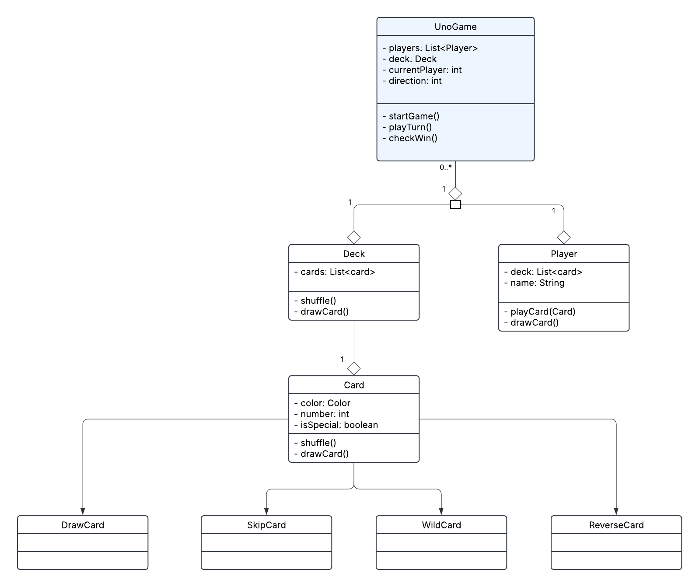

# Technical Details:

Period 3
Anzam Siddek, Abdul Siddique
Group: Ace of Spades

Brief Project Description:
Our goal is to recreate the card game “UNO!” where a user can play against their desired number of bots, with the maximum being four. The user and each of the bots will start out with a deck of seven cards and a random card will be used to begin the game. The user and each of the bots will be able to draw random cards from a deck when needed. The bots will be programmed to place the highest amount of cards possible each turn. Certain cards will have special functionalities such as the Skip card (skips all the other players’ turns), the Reverse card (reverses the direction in which the players take turns), etc. 

Expanded Description:
- Critical features (MVP):
- Giving each player deck of random cards
- Include all available cards in a standard deck 
- Cycles through players’ turns in right direction
- Card logic (only being able to use certain cards)
- Special cards (skip, reverse, draw two, draw 4, wildcard)
- Drawing cards (only when needed)
- Calling UNO when player has one card left
- Check for win (player has zero cards)

Additional Features: 
- Customize chances to get special cards
- Draw two card penalty for mistakes
- Timer for each player’s turn
- Difficulty level for bots
- SFX / Music

     
# Project Design

UML Diagrams and descriptions of key algorithms, classes, and how things fit together.

    
# Intended pacing:

How you are breaking down the project and who is responsible for which parts.

A timeline with expected completion dates of parts of the project. (CHANGE THIS!!!!!)

